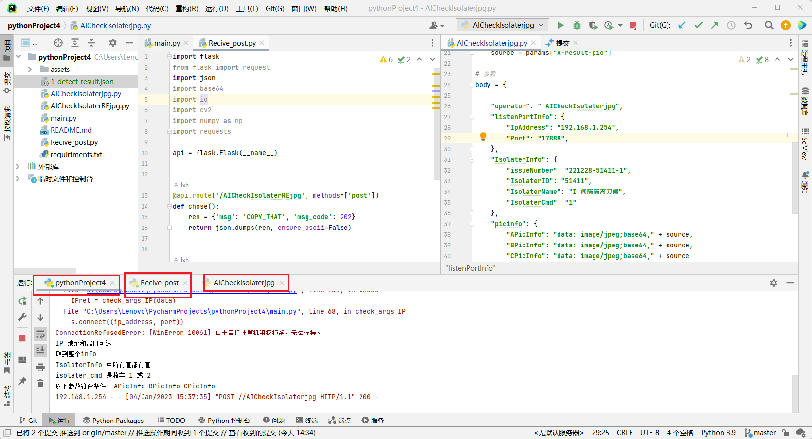

# **这是一个测试项目**

本测试项目用于测试通讯功能，即模拟开发算法软件时的调试环境。

## 安装环境

已测试环境：

`pycharm 22.3 + python 3.10`

需要拥有pip工具

终端输入：

`pip install -r requirements.txt`

或者使用pycharm一键安装`requirements.txt`中的内容

## 文件结构


```python
AICheckIsolaterjpg.py#模拟应用服务post算法服务器脚本

AICheckIsolaterREjpg.py#模拟算法服务器pos应用服务检测结果的脚本

main.py#算法服务的json校验代码

Recive_post.py#模拟应用服务开放端口post算法服务器脚本

1_detect_result.json#存储base64编码的json文件
```

## 测试流程

首先运行`main.py`


打开并行运行按钮。应为需要同时运行两个flask服务。


修改此处的IP地址或端口。

此端口为算法服务的监听端口。

运行`Recive_post.py`，打开模拟应用服务监听程序。

下面开始运行测试判定代码。

```json
with open('base64_incode.json', 'rb') as p:
    params = json.load(p)  # 加载json文件
    source = params["A-result-pic"]
//可以加载json文件只需要键值对即可
{
"A-result-pic"："base64code"
}

```



运行测试时需要同时运行`main.py`以及`Recive_post.py`。

确保运行好后运行`AICheckIsolaterjpg.py`即可。

**正确解析，且所以参数均已被校验**


`AICheckIsolaterjpg.py`打印回复消息。

## 注意事项

1. 本项目中的内容均为模拟代码，不会在实际项目中使用，逻辑相同实现不同。

2. `Recive_post.py`中的ip地址也需要修改。

   


